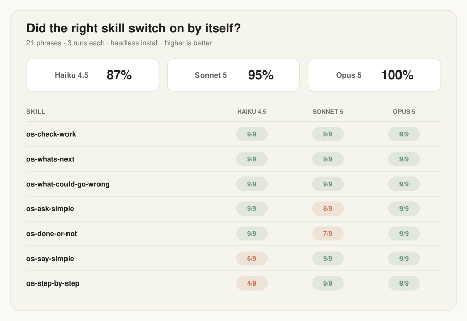

# Open Steps

[](LICENSE)

**Skills that keep development open to the person running it: the sessions,
the decisions, the next steps, all in plain language.**

By [Pavlo Kharmanskyi](https://github.com/kharmanskyi).

I'm not an engineer. I'm a market-led builder: I look for where demand already
exists and the infrastructure doesn't, then build the missing piece. Twenty
years of building web and software products, always from the product side, and
more than 50 developers at my company today.

Apart from the company, I started building a product on my own, just
vibecoding. Partly to stay ahead of where all this is going, partly because I
think the moment has arrived for people like me: you can now imagine a serious
product and build it yourself, with no engineers or very few of them.

Then I ran straight into a wall. The agent does excellent work, then tells me
about it in commit hashes and jargon, and I genuinely cannot tell whether we
are done. Not because the work is unclear. Because nobody taught the agent to
talk to someone who doesn't speak engineering.

So I built this pack. I'm sharing it here for anyone in the same position, and
that's the whole idea behind the name: every step of building with an agent,
kept open to the person doing the building. Right now it changes what the agent
tells you. Where I want to take it next is the work itself, not just the
reporting.

## Before and after

The whole idea in one screen. Work ends, you ask "are we done?".


<details>
<summary>The same thing as text, if the picture does not load</summary>

Without the pack:

> Hotfix deployed: session TTL misconfig in auth middleware caused 401
> cascades after key rotation; patched the refresh path, invalidated stale
> JWTs, redeployed api+web. p95 back to 180ms. Root cause: env drift after
> the 09-14 rollout. Two flaky e2e specs quarantined (known, tracked)…

With it you get this:

> People can sign in again. A bug was logging people out because their
> sessions expired far too early. The fix is live for everyone.
>
> | | |
> |---|---|
> | ✅ | Response times are back to normal |
> | ⚠️ | Until this shipped, people were being logged out over and over. |
>
> | Fully done? | Yes |
> |---|---|
> | **Anything needed from you?** | No |
> | **New debt?** | Two small ones, written down |
> | **Safe to close?** | Yes |

</details>

Same facts. One screen. The bad news gets its own row instead of hiding in
the middle of a paragraph. A second, longer example from a real session lives
in this repository, with notes on what the rewrite changed:
[`skills/os-done-or-not/references/01-prod-promote.md`](skills/os-done-or-not/references/01-prod-promote.md).

## Quick start

Claude Code is what the pack is built and measured on, and the only tool where
everything works with no extra steps. The skills and the routing block also
install into Codex, Cursor and Gemini CLI, see
[Other agents](#other-agents-codex-cursor-gemini-cli) below. `git` and `gh` are
optional: a couple of the skills read project state through them, and without
those tools more of the output honestly says "not checked".

Clone this repository:

```bash
git clone https://github.com/kharmanskyi/open-steps.git
```

Both commands below run from the folder you cloned it into, the one that now
holds `open-steps/`, not from inside the clone. First, install it as a plugin:

```bash
claude plugin marketplace add ./open-steps && claude plugin install open-steps@open-steps
```

That's it. The skills and both hooks are wired for you. Check what you got:

```bash
claude plugin details open-steps
```

Later, to check the whole install rather than just the plugin, run
`/open-steps:os-install-check` in the agent. It reports what is wired and what is
not, and says "not checked" where it could not look.

One thing is worth adding by hand, and no installer can do it for you: a short
block in your own `~/.claude/CLAUDE.md`. Skills are something the model
chooses to use. The hooks remind it; the block makes it a rule, and it
survives long conversations. One command, from the same folder, safe to re-run:

```bash
grep -q 'os-done-or-not' ~/.claude/CLAUDE.md 2>/dev/null || cat open-steps/docs/routing-block.md >> ~/.claude/CLAUDE.md
```

The reasoning is in [`docs/claude-md.md`](docs/claude-md.md).

To update: `git pull` inside `open-steps/`, then
`claude plugin update open-steps@open-steps`. Both halves matter: the plugin
updates from your clone, not from GitHub, so without the pull "already at the
latest version" is true of the folder and wrong about this repository. And
`update` wants the full plugin@marketplace name, where `uninstall` accepts the
short one. To remove: `claude plugin uninstall open-steps`, then take the
block back out of your `CLAUDE.md`.

The one piece that stays manual is the writing style, because turning it on
would silently replace whatever style you already chose. Two lines, in
[`docs/output-style.md`](docs/output-style.md).

## Other agents: Codex, Cursor, Gemini CLI

Codex, Cursor and Gemini CLI all read `~/.agents/skills/`, so one command
installs the pack into all three. Run it from the folder holding the clone:

```bash
mkdir -p ~/.agents/skills && cp -R open-steps/skills/os-* ~/.agents/skills/
```

Then the routing block goes into whatever that tool treats as your standing
instructions, doing the same job it does in `CLAUDE.md` above:

| Tool | Routing block goes in | Evidence |
|---|---|---|
| Codex | `~/.codex/AGENTS.md` | checked, on Codex CLI 0.145 |
| Cursor | `AGENTS.md` in the project root | Cursor's documentation |
| Gemini CLI | `~/.gemini/GEMINI.md` | Gemini CLI's documentation |

The hooks are the part that differs per tool. Codex runs both of them
unchanged, with a short block in `~/.codex/config.toml` and one trust prompt to
accept. Cursor
and Gemini CLI want JSON where these two print text, so both need an adapter
that is not written yet, and on Cursor a stop cannot be blocked at all. On
both, the skills and the routing block install; how reliably the skills fire
there is not checked.

The commands, the paths, the Codex hook config, and what was run rather than
read: [`docs/other-agents.md`](docs/other-agents.md).

## The skills

| Skill | What it does | When it fires |
|---|---|---|
| [`os-done-or-not`](skills/os-done-or-not/) | A one-screen report with a verdict: done or not, anything needed from you, any new debt, safe to close | Work wraps up, or you ask how it went |
| [`os-step-by-step`](skills/os-step-by-step/) | Numbered steps a non-technical person can follow. The agent must first try everything itself and ask only for what truly needs you | The agent needs you to run, paste, click, approve or test something |
| [`os-ask-simple`](skills/os-ask-simple/) | The question in plain words, what it costs later, and one marked recommendation | The agent has a question or options for you |
| [`os-what-could-go-wrong`](skills/os-what-could-go-wrong/) | Assumes the decision already failed and works backwards to find out why, in a fresh agent that had no hand in it. Ends on one verdict | Something hard to undo is about to be agreed - a contract, a purchase, a migration, a launch |
| [`os-whats-next`](skills/os-whats-next/) | Merges what is verified and ready, then recommends the next task and says why in plain words | You ask what is left or what to do next |
| [`os-check-work`](skills/os-check-work/) | Does not trust another session's report. Checks every claim against what actually happened, then says what to do about it | Another session says it is done |
| [`os-say-simple`](skills/os-say-simple/) | Rewrites any text in plain words without losing facts or bad news. Give it a number and you get exactly that many points | Any text reads like engineering: a report, a comment, an error, the agent's own answer |
| [`os-whats-built`](skills/os-whats-built/) | Keeps one `ROADMAP.md`: what the product is, every feature with how far it got, which parts nobody uses any more, and what is queued | You ask what is in the project, or a session report was just written |

They work as a loop: `os-whats-next` picks the work, `os-step-by-step` walks
you through your part, `os-done-or-not` reports the result, `os-check-work`
accepts what other sessions did, `os-ask-simple` handles the questions on the
way, `os-what-could-go-wrong` attacks anything hard to undo before it is
agreed, and `os-say-simple` rescues any text that still reads like
engineering.

`os-whats-built` is the one that is not session-shaped. Everything else
describes a session; it keeps the standing picture of the product, in a
`ROADMAP.md` in the project itself. That closes the loop at the point it used
to break: `os-whats-next` is told to read the backlog **always**, and until
now nothing in the pack ever wrote one. Two things it will not do - invent a
task, or delete anything. It measures how old each part is and whether
anything still reaches it, and quiet code that is still used is reported as
finished, not as rot.

## Numbers

The pack tells the agent to separate what it measured from what it assumed.
Same rule for me.

Twenty-one phrases a person would actually say, three per skill, each asked
three times, headless, in a working installation, on three Claude models. The
question every time: did the right skill switch on by itself? Three off-topic
questions, each also asked three times, checked the opposite. Remeasured in
full on 2026-08-29, the day the seventh skill landed.

`os-whats-built` is **not in these numbers.** Its three phrases are in
`cases.md`, but the sweep has not been re-run since it landed, so its
activation is unmeasured - and it is the skill most likely to take a phrase
from `os-whats-next`, since both answer a question about the project as a
whole. Run `bash evals/run.sh` before trusting either number.



| Skill | Haiku 4.5 | Sonnet 5 | Opus 5 |
|---|---|---|---|
| `os-check-work` | 9/9 | 9/9 | 9/9 |
| `os-whats-next` | 9/9 | 9/9 | 9/9 |
| `os-what-could-go-wrong` | 9/9 | 9/9 | 9/9 |
| `os-ask-simple` | 9/9 | 8/9 | 9/9 |
| `os-done-or-not` | 9/9 | 7/9 | 9/9 |
| `os-say-simple` | 6/9 | 9/9 | 9/9 |
| `os-step-by-step` | 4/9 | 9/9 | 9/9 |
| **All 21 phrases** | **87%** | **95%** | **100%** |
| Fired on an off-topic question | 1/9 | 0/9 | 0/9 |

The honest reading, because the misses matter more than the score.

- On Sonnet 5 and Opus 5 this works. Three skills are perfect on every model,
  and Opus missed nothing at all.
- `os-what-could-go-wrong` was named the skill most likely to steal a phrase
  from `os-ask-simple`, so that was measured before it merged: 27/27 on its
  own phrases, `os-ask-simple` did not drop, and off-topic questions still
  leave it silent. The fear did not survive the measurement.
- Sonnet 5 dropped two runs of the vaguest phrase ("That's it for today. What
  happened?") to no skill at all, not to the new one. Asked six more times
  the same way, it fired six of six. Read the 7/9 as the same run-to-run
  wobble Haiku shows below; it stays in the table because that is what the
  pass measured.
- On Haiku 4.5, two skills are unreliable and one off-topic question wrongly
  pulled in a skill. If you run on the cheapest model, expect to type the
  skill name yourself sometimes.
- Haiku also moves between runs. Three sweeps of the same phrases have put
  `os-step-by-step` at 50%, 33% and now 44%, and false fires at zero and one.
  Three runs per phrase is a smoke test, not a benchmark, and small numbers
  wobble. I would rather say that than quote the friendliest sweep.
- Where Haiku misses, it usually asks a clarifying question first: told "put
  a secret on the server, tell me what to do", it wants to know which server
  and which secret. That is the pack's own earn-the-ask rule; a one-shot test
  scores it as a miss.
- The test set is mine, and it is small. Twenty-four phrases in a repository
  you can read - the twenty-one scored above, plus three that have not been
  run yet - so write better ones and re-run it.

Two things earlier rounds cost me, kept here because they are the useful part.
A negation inside a description ("this is NOT the skill for X") is ignored, so
boundaries between overlapping skills get drawn by removing triggers, not by
adding warnings. And a phrase with a false premise ("you said X" at the start
of an empty session) is refused by the model, correctly, so test phrases have
to carry their own context.

Everything is in [`evals/`](evals/), and two files are enough if you just want
to look: [`cases.md`](evals/cases.md) is every phrase we ask,
[`results.md`](evals/results.md) is what came back, phrase by phrase, so every
miss above has a row you can read. The scorer writes that file; I don't type
it. Scoring is a plain script reading tool calls, with no AI judging anything.
Re-run it with `bash evals/run.sh`, or `EVAL_MODEL=opus bash evals/run.sh` for
another model.

Also measured, and easy to check yourself: the skill descriptions cost **770
tokens per session**, always on, which Claude Code reports itself with
`claude plugin details open-steps`. That figure was taken before
`os-what-could-go-wrong` was added and has not been retaken; run the command
for the current one. The session-start hook adds its injection
on top, capped by `OPEN_STEPS_MAX_REPORT_LINES`. Installing works from a
clean empty account, with both hooks connected. `claude plugin validate
--strict` passes.

## How the pack is built

Each skill is one folder with one `SKILL.md` inside: a short header, then the
rules. Some also carry a worked example in a `references/` folder. Nothing
runs on your machine except the two hooks, and those are plain shell scripts
you can read in a minute.

One thing to know before installing: **the pack finishes finished work by
itself.** If a pull request has green checks and an approved review, it gets
verified once more and merged. No asking. Whatever unblocks the most goes
first. Only two things stop a merge: a claim that fails verification, or a
note on the task saying merges happen on command only. Write that note
wherever an orchestrator owns the merge; put the same note in your own
`~/.claude/CLAUDE.md` if you never want merges happening on their own.

And what a skill may do without asking. A skill can pre-approve tools for the
one turn it runs in, so this pack keeps that list down to what it actually
needs: its own reports folder, the `gh pr` calls that read a pull request, and
`gh pr merge`, because merging finished work is the behaviour above. Nothing
else. Every other command, and every file outside your project and that
folder, goes through your own permission settings as usual. Reading with `git`
needs no entry at all: Claude Code already treats read-only `git` as
read-only.

Three decisions shape everything here:

1. **Descriptions are commands, not summaries.** Every skill opens with
   "ALWAYS invoke this skill when…". Published measurements say this form
   fires far more reliably than a polite description.
2. **A skill cannot force itself to run.** Anything that must hold in every
   reply lives in `CLAUDE.md` or the output style instead. The pack says
   which layer each piece belongs to.
3. **Measured and assumed never mix.** A "yes" has to name its proof.
   Anything unchecked says "not checked". This is also why the reports are
   short: the agent stops narrating its checks and states the result.

The plain-language rules borrow from ASD-STE100, the simplified English
written for aerospace manuals: short sentences, active voice, one idea per
sentence. Borrow is the word. Nothing here is certified against the standard.

## Optional pieces and limits

The [`answer-first`](docs/output-style.md) output style makes the agent put
the answer in the first line and stop narrating its verification.

Two hooks come connected with the plugin.
[`session-start.sh`](hooks/session-start.sh) puts the routing table and the
last report in front of a new session, and quietly records what your
repositories looked like at that moment.
[`stop-report.sh`](hooks/stop-report.sh) compares against that when the session
ends and asks for a report if real work landed, which is also how work you
finished inside a single reply still gets one. Neither hook can loop: reports
are written outside your repositories, so writing one changes nothing they
look at. The stop hook is free when it stays quiet; the start hook does add its
injection to your context, capped by the setting below. Their settings:

| Setting | Default | What it does |
|---|---|---|
| `OPEN_STEPS_COOLDOWN` | 900 | seconds of quiet between report requests |
| `OPEN_STEPS_MIN_FILES` | 1 | changed files before a report is asked for |
| `OPEN_STEPS_MAX_REPOS` | 25 | started in a folder of repositories, how many get checked |
| `OPEN_STEPS_DISABLE` | unset | set to anything to switch the stop hook off |
| `OPEN_STEPS_MAX_REPORT_LINES` | 80 | cap on the injected last report |
| `OPEN_STEPS_NO_SESSION_START` | unset | set to anything to switch the start hook off |

Reports are saved outside your repositories, in
`~/.claude/open-steps/reports/<project>/`, so they never land in a commit and
they survive uninstalling the pack.

And the honest limits. Not every skill has a worked example yet.
`os-whats-next` and `os-check-work` read project state through `git` and `gh`;
without those tools, more of the output says "not checked". The writing style
does not reach subagents; `os-what-could-go-wrong`, the only skill that
dispatches one, carries its rules inside the handover instead, so its plain
language rests on `references/premortem-prompt.md` alone.

## Open source

Free, MIT licensed. Take it, use it at work, change it, fork it.

I keep building this pack for my own work, so it moves on its own. Pull
requests are welcome and I read them; the rules are in
[CONTRIBUTING.md](CONTRIBUTING.md).

If it helped, a star makes it easier for other people to find.

## License

MIT - see [LICENSE](LICENSE). © 2026 Pavlo Kharmanskyi.

Open Steps Skills is an independent and open-source project. Claude and Claude
Code are trademarks of Anthropic. All other trademarks are the property of their
respective owners.
