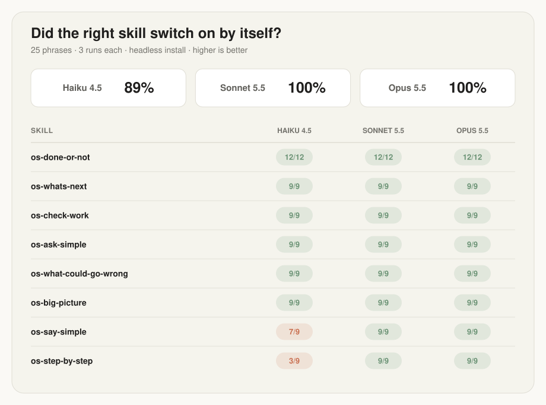

# Open Steps

[](LICENSE)

**English** · [Español](README.es.md) · [Français](README.fr.md) · [Русский](README.ru.md) · [Українська](README.uk.md) · [한국어](README.ko.md) · [中文](README.zh.md)

**Plain-language agent skills for Claude Code, Codex, Cursor and Gemini CLI.**

They keep development open to the person running it: the sessions, the
decisions, the next steps, the whole picture.

By [Pavlo Kharmanskyi](https://github.com/kharmanskyi).

I'm not an engineer. I'm a market-led builder: I look for where demand already
exists and the infrastructure doesn't, then build the missing piece. Twenty
years of building web and software products, always from the product side, and
more than 50 developers at my company today.

Apart from the company, I started building a product on my own, just
vibecoding. Partly to stay ahead of where all this is going, partly because I
think the moment has arrived for people like me: you can now imagine a serious
product and build it yourself, with no engineers or very few of them.

Then I ran straight into a wall. The agent does excellent work, then tells me
about it in commit hashes and jargon, and I genuinely cannot tell whether we
are done. Not because the work is unclear. Because nobody taught the agent to
talk to someone who doesn't speak engineering.

So I built this pack. I'm sharing it here for anyone in the same position, and
that's the whole idea behind the name: every step of building with an agent,
kept open to the person doing the building. Right now it changes what the agent
tells you. Where I want to take it next is the work itself, not just the
reporting.

## Before and after

The whole idea in one screen. Work ends, you ask "are we done?".


<details>
<summary>The same thing as text, if the picture does not load</summary>

Without the pack:

> Hotfix deployed: session TTL misconfig in auth middleware caused 401
> cascades after key rotation; patched the refresh path, invalidated stale
> JWTs, redeployed api+web. p95 back to 180ms. Root cause: env drift after
> the 09-14 rollout. Two flaky e2e specs quarantined (known, tracked)…

With it you get this:

> People can sign in again. A bug was logging people out because their
> sessions expired far too early. The fix is live for everyone.
>
> | | |
> |---|---|
> | ✅ | Response times are back to normal |
> | ⚠️ | Until this shipped, people were being logged out over and over. |
>
> | Fully done? | Yes |
> |---|---|
> | **Anything needed from you?** | No |
> | **New debt?** | Two small ones, written down |
> | **Safe to close?** | Yes |

</details>

Same facts. One screen. The bad news gets its own row instead of hiding in
the middle of a paragraph. A second, longer example from a real session lives
in this repository, with notes on what the rewrite changed:
[`skills/os-done-or-not/references/01-prod-promote.md`](skills/os-done-or-not/references/01-prod-promote.md).

## The skills

| Skill | What it does | When it fires |
|---|---|---|
| [`os-done-or-not`](skills/os-done-or-not/) | A one-screen report with a verdict: done or not, anything needed from you, any new debt, safe to close | Work wraps up, or you ask how it went |
| [`os-step-by-step`](skills/os-step-by-step/) | Numbered steps a non-technical person can follow. The agent must first try everything itself and ask only for what truly needs you | The agent needs you to run, paste, click, approve or test something |
| [`os-ask-simple`](skills/os-ask-simple/) | The question in plain words, what it costs later, and one marked recommendation | The agent has a question or options for you |
| [`os-what-could-go-wrong`](skills/os-what-could-go-wrong/) | Assumes the decision already failed and works backwards to find out why, in a fresh agent that had no hand in it. Ends on one verdict | Something hard to undo is about to be agreed: a contract, a purchase, a migration, a launch |
| [`os-whats-next`](skills/os-whats-next/) | Merges what is verified and ready, then recommends the next task and says why in plain words | You ask what is left or what to do next |
| [`os-check-work`](skills/os-check-work/) | Does not trust another session's report. Checks every claim against what actually happened, then says what to do about it | Another session says it is done |
| [`os-say-simple`](skills/os-say-simple/) | Rewrites any text in plain words without losing facts or bad news. Give it a number and you get exactly that many points | Any text reads like engineering: a report, a comment, an error, the agent's own answer |
| [`os-big-picture`](skills/os-big-picture/) | Keeps one `BIG-PICTURE.md`: what the product is, every feature with how far it got, which parts nobody uses any more, and what is queued. It offers to open the queue as tickets in a tracker you already use | You ask where the project stands, or a session report was just written |

They work as a loop: `os-whats-next` picks the work, `os-step-by-step` walks
you through your part, `os-done-or-not` reports the result, `os-check-work`
accepts what other sessions did, `os-ask-simple` handles the questions on the
way, `os-what-could-go-wrong` attacks anything hard to undo before it is
agreed, and `os-say-simple` rescues any text that still reads like
engineering. `os-big-picture` keeps the standing file whose queue
`os-whats-next` reads as its backlog.

`os-big-picture` writes its file in plain words, so you get the whole picture
without reading code. It measures from git how old each part is and whether
anything still uses it, and it dates what it cannot measure. It opens tickets
in your tracker only after you say yes. The file stays out of your commits
unless you add it yourself. It never invents a task and never deletes
anything. The rules and the reasons behind them are in
[`skills/os-big-picture/`](skills/os-big-picture/).

## What it does on its own

**The pack finishes finished work by itself.** If a pull request has green
checks and an approved review, the agent verifies it once more and merges it.
On Claude Code that happens without a permission prompt. On Codex CLI, Cursor
CLI and Gemini CLI the merge command goes through that tool's own permission
settings, per their documentation. Whatever unblocks the most goes first.

Two things stop a merge: a claim that fails verification, or a note on the
task saying merges happen on command only. Write that note on the task
wherever another tool or person decides when to merge. To have merges on
command only, put the same note in your standing instructions file:
`~/.claude/CLAUDE.md`, `~/.codex/AGENTS.md`, `~/.gemini/GEMINI.md`, or the
project's `AGENTS.md` on Cursor CLI.

On Claude Code a skill can also pre-approve tools for the turn it runs in,
through its `allowed-tools` field. This pack keeps that list to what the
skills use:

| Skill | Pre-approved on Claude Code |
|---|---|
| Every skill | Reading its reports folder, `~/.claude/open-steps/` |
| `os-done-or-not` | Writing its report in that folder, and `gh pr view` and `gh pr checks` |
| `os-whats-next`, `os-check-work` | `gh pr list`, `gh pr view`, `gh pr checks` and `gh pr diff`, which read a pull request, and `gh pr merge`, for the merges above |
| `os-big-picture` | Editing its own `BIG-PICTURE.md`, its census script, `git rev-parse --git-dir` to find the repository folder, `gh repo view`, `gh issue list`, and `gh issue create`, which opens tickets after you say yes |
| `os-what-could-go-wrong` | Its premortem prompt script |
| `/open-steps:os-install-check` | `doctor.sh` |

Other commands, and files outside your project and the reports folder, go
through your own permission settings as usual. Other read-only `git` commands
need no entry, because Claude Code runs them without asking. Codex CLI, Cursor
CLI and Gemini CLI ignore the field, per their documentation, and
ask the way they normally do. That part has not been tested.

<a id="quick-start"></a>

## Install

The skills are the same folders on every tool. On Claude Code a plugin
installs them and wires both hooks in one command. On Codex CLI, Cursor CLI
and Gemini CLI one copy command installs the skills, and each tool takes a few
lines of hook settings. What was run on each tool, and what comes from its
documentation, is under [What was run on each tool](#what-was-run-on-each-tool).

### First, for any tool

You need `git` to download the pack and to update it. Some skills, such as
`os-whats-next` and `os-check-work`, also read project state through `git` and
`gh`, GitHub's command-line tool. `gh` is
optional. Without it, more of the output says "not checked".

Clone this repository:

```bash
git clone https://github.com/kharmanskyi/open-steps.git
```

Stay in the folder where you ran that command, the one that now holds
`open-steps/`. The commands below run from there. Only `git pull` runs inside
the clone.

On every tool you add one piece by hand: the routing block. The agent decides
by itself whether to use a skill. The routing block is a short table that
names the moments when it must use one, and which one. It goes in the file
your tool reads as standing instructions, and each tool's part below names
that file. [Why the block matters](docs/claude-md.md).

The pack also has two hooks. One starts each session with the routing table
and your last report. The other asks for a report when a session ends with
real work done. How they work: [The hooks](#the-hooks).

### Claude Code

Install the pack as a plugin. This wires the skills and both hooks:

```bash
claude plugin marketplace add ./open-steps && claude plugin install open-steps@open-steps
```

Check what you got:

```bash
claude plugin details open-steps
```

To check the whole install, not just the plugin, run
`/open-steps:os-install-check` in Claude Code. It reports what is wired and
what is not, and says "not checked" where it could not look.

The routing block goes in your own `~/.claude/CLAUDE.md`, where it survives
long conversations. One command, from the same folder, safe to re-run:

```bash
grep -q 'os-done-or-not' ~/.claude/CLAUDE.md 2>/dev/null || cat open-steps/docs/routing-block.md >> ~/.claude/CLAUDE.md
```

To update: `git pull` inside `open-steps/`, then
`claude plugin update open-steps@open-steps`. Both steps are needed. The
plugin updates from your clone, not from GitHub. Without the pull it says
"already at the latest version" about an old copy. The installed copy changes
only when the pack's version number does.

To remove: `claude plugin uninstall open-steps`, then take the block back out
of your `~/.claude/CLAUDE.md`.

The pack also has an optional output style for Claude Code, Answer first. It
makes the agent put the answer in the first line and stop narrating its
checks. It is off by default, because turning it on would replace a style you
already chose. Turning it on takes two lines, in
[`docs/output-style.md`](docs/output-style.md). Output styles are a Claude
Code setting, so the pack does not wire it on Codex CLI, Cursor CLI or Gemini
CLI.

<a id="other-agents-codex-cursor-gemini-cli"></a>

### Codex CLI, Cursor CLI and Gemini CLI

These three tools read `~/.agents/skills/`, so one command installs the skills
for all of them:

```bash
mkdir -p ~/.agents/skills && cp -R open-steps/skills/os-* ~/.agents/skills/
```

The rest is set per tool:

| | Codex CLI | Cursor CLI | Gemini CLI |
|---|---|---|---|
| Routing block goes in | `~/.codex/AGENTS.md` | `AGENTS.md` in the project root | `~/.gemini/GEMINI.md` |
| Hooks go in | `~/.codex/config.toml`. Per Codex's docs, it then asks once to trust them | `~/.cursor/hooks.json`, through `hooks/adapter.sh` | `~/.gemini/settings.json`, through `hooks/adapter.sh`, with the stop hook on `AfterAgent` |
| Check | `bash open-steps/doctor.sh` | `bash open-steps/doctor.sh` | `bash open-steps/doctor.sh` |
| Update | `git pull` inside `open-steps/`, then the copy command again | `git pull` inside `open-steps/`, then the copy command again | `git pull` inside `open-steps/`, then the copy command again |
| Remove | Delete the `os-*` folders from `~/.agents/skills/`, the block from `~/.codex/AGENTS.md`, and the two hook entries from `~/.codex/config.toml` | Delete the `os-*` folders from `~/.agents/skills/`, the block from `AGENTS.md`, and the two hook entries from `~/.cursor/hooks.json` | Delete the `os-*` folders from `~/.agents/skills/`, the block from `~/.gemini/GEMINI.md`, and the two hook entries from `~/.gemini/settings.json` |

The routing block command for each tool, safe to re-run, is in
[`docs/other-agents.md`](docs/other-agents.md#the-routing-block). So are the
hook settings, in [The hooks](docs/other-agents.md#the-hooks) there, and
everything that was run rather than read.

`doctor.sh` reads the shared skills folder and each tool's own, the routing
block, and the hook settings of each tool it finds. It says "not checked" for
what it cannot look at. It does not check which event each hook sits under.

The skills are a copy, so they stay as they were until you run the copy
command again. The remove steps have not been run yet.

If you also use Claude Code in a project where the block sits in `AGENTS.md`
for Cursor CLI: Claude Code 2.1.277 and later reads a project's `AGENTS.md`
when the project has no `CLAUDE.md`, per its changelog. So the block reaches
Claude Code in that project too.

## What was run on each tool

Each cell says how we know. The words mean:

- **measured**: counted over repeated runs of the same test phrases.
- **watched**: seen happening in a real session.
- **checked by hand**: the hook scripts were fed test input, not seen in a
  live session.
- **from docs**: set up the way the tool's documentation says, not seen on its
  own.
- **in place**: present during the runs, its own effect not tested.
- **did not start**: tried, and it did not happen.
- **not measured** or **not tried**: no count was taken, or nobody has run it.

The numbers in brackets point to the notes under the table.

| | Skills install | Routing block | Session-start hook | Stop hook | Switches on by itself | Premortem starts a fresh agent |
|---|---|---|---|---|---|---|
| Claude Code | watched (1) | in place (2) | watched (2) | watched (2) | measured: 85% to 100% (3) | measured: 9/9 and 8/9 (4) |
| Codex CLI | watched (5) | from docs, in place (6) | checked by hand (7) | checked by hand (7) | measured: right skill read in 75 of 75, first in 70 (8) | did not start on 0.151 (9) |
| Cursor CLI | watched (10) | from docs | watched (10) | watched: asks, cannot require (10, 11) | not measured (12) | not tried |
| Gemini CLI | watched (10) | in place (10, 13) | watched (10) | watched: can refuse (10, 14) | not measured (12) | not tried |

1. Installed as a plugin from a clean, empty account, with both hooks
   connected. `claude plugin validate --strict` passes.
2. The plugin wires both hooks. In the measured runs the routing block was in
   place, the session-start hook was on and the stop hook was off.
3. 2026-09-12, 25 phrases, 3 runs each: Haiku 4.5 85%, Sonnet 5 98%, Opus 5
   100%. See [Numbers](#numbers).
4. 2026-09-14: the fresh agent started in 9 of 9 runs on Sonnet 5 and in 8 of
   9 on Opus 5. The skill's wording changed on 2026-09-30, after this
   measurement: it now says what to do where no fresh agent can start. Its
   steps on Claude Code are the same.
5. A contributor listed the skills on Codex CLI 0.145 on 2026-08-25 (OS not
   recorded). That listing came before `os-what-could-go-wrong` and
   `os-big-picture` were added. In the measured runs on 0.157.1 every skill
   was read.
6. Placed where Codex's docs say, and in place in the measured runs.
7. The Codex hook scripts were fed Codex-shaped input, and the hook test suite
   keeps that input as one of its cases. Nobody has watched Codex run them in a
   live session.
8. 2026-09-28, Codex CLI 0.157.1 on Linux, model asked for: gpt-6-sol. The
   right skill was read in 75 of 75 runs, first in 70. One contributor's runs,
   scored by the maintainer. See [On Codex CLI](#on-codex-cli).
9. Codex CLI 0.151 on Linux, 4 runs by a contributor. No fresh agent started.
   The agent ran the review itself, and all 4 runs wrongly called the review
   independent. This check came before later changes to the skill. It is not
   measured on 0.157.1. In the 0.157.1 activation runs no transcript shows one
   starting, but 5 of 9 were cut off. See [On Codex CLI](#on-codex-cli).
10. Every Cursor CLI and Gemini CLI cell: Cursor CLI 2026.09.02 and Gemini
    CLI 0.58.0, on Windows 11, in one contributor's runs. The maintainer has
    not reproduced them. The Cursor desktop app has not been tried.
11. A stop cannot be blocked on Cursor CLI. So the report is asked for as a
    follow-up message, not required. A run with no one at the keyboard
    (`agent -p`) did not reach the stop hook.
12. No skill has been seen switching on from a phrase on these two tools yet.
    There, `os-done-or-not` ran when the stop hook asked for it. Help wanted:
    [#40](https://github.com/kharmanskyi/open-steps/issues/40) Cursor CLI,
    [#38](https://github.com/kharmanskyi/open-steps/issues/38) Gemini CLI.
13. Watched in place on 0.58.0. It was not seen steering a skill.
14. On Gemini CLI the stop hook can refuse, on `AfterAgent`. Gemini's file
    tool cannot write outside the workspace. In a run with no one at the
    keyboard, the report went to Gemini's own temp folder instead. So the
    request now says to save the report with the shell tool. That sentence
    went in after the run and was not itself watched.

## Numbers

The table and the chart below are for Claude Code with Claude models. Codex
CLI has its own part at the end of this section,
[On Codex CLI](#on-codex-cli). On Cursor CLI and Gemini CLI switching on is
not measured, as [What was run on each tool](#what-was-run-on-each-tool) shows.

The pack tells the agent to separate what it measured from what it assumed.
Same rule for me.

Twenty-five phrases a person would actually say: three per skill, plus one
that tests the line between `os-done-or-not` and `os-big-picture`. Each was
asked three times, with no one at the keyboard, in a working installation, on
three Claude models. The question every time: did the right skill switch on by
itself? Three off-topic questions, each also asked three times, checked the
opposite. Three runs per phrase is a smoke test, not a benchmark, and small
numbers wobble.



<!-- numbers: score.py writes this table, edit the prose but not these rows -->

Measured on 2026-09-12.

| Skill | Haiku 4.5 | Sonnet 5 | Opus 5 |
|---|---|---|---|
| `os-done-or-not` | 11/12 | 12/12 | 12/12 |
| `os-whats-next` | 9/9 | 9/9 | 9/9 |
| `os-check-work` | 9/9 | 9/9 | 9/9 |
| `os-what-could-go-wrong` | 9/9 | 9/9 | 9/9 |
| `os-big-picture` | 9/9 | 9/9 | 9/9 |
| `os-ask-simple` | 7/9 | 9/9 | 9/9 |
| `os-say-simple` | 6/9 | 9/9 | 9/9 |
| `os-step-by-step` | 4/9 | 8/9 | 9/9 |
| **All 25 phrases** | **85%** | **98%** | **100%** |
| Fired on an off-topic question | 0/9 | 0/9 | 0/9 |

<!-- numbers: end -->

What the misses show, because they matter more than the score.

- On Sonnet 5 and Opus 5 this works. Four skills are perfect on every model,
  and Opus missed nothing at all. Two of the four, `os-big-picture` and
  `os-whats-next`, both answer questions about the project as a whole. So they
  were the pair most likely to take each other's phrases. They did not.
- `os-what-could-go-wrong` was the skill most likely to take phrases from
  `os-ask-simple`, so it was measured before it went in: 27/27 on its own
  phrases, `os-ask-simple` did not drop, and off-topic questions still left it
  silent.
- Sonnet 5 missed one run in seventy-five, on a step-by-step phrase. An
  earlier round missed two runs of another phrase. Read both as run-to-run
  wobble, smaller than Haiku's.
- On Haiku 4.5, two skills are unreliable and a third dropped two runs. If you
  run on the cheapest model, expect to type the skill name yourself sometimes.
- Haiku also moves between runs. Four rounds of the same phrases have put
  `os-step-by-step` at 50%, 33%, 44% and 44%, and off-topic questions that
  pulled in a skill at zero, one and zero. I would rather say that than quote
  the friendliest round.
- Where Haiku misses, it usually asks a clarifying question first. Told "put
  a secret on the server, tell me what to do", it wants to know which server
  and which secret. The pack wants the agent to settle what it can before it
  asks you, so asking which server first is close to what `os-step-by-step`
  would do. A one-shot test, with no one to answer, scores it as a miss.
- The test set is mine, and it is small. Twenty-five phrases in a repository
  you can read, every one of them scored above, so write better ones and
  re-run it.

Two lessons from earlier rounds, for anyone writing their own phrases. A "not"
inside a description ("this is NOT the skill for X") is ignored. So the line
between two similar skills is drawn by removing a trigger, not by adding a
warning. And a phrase with a false premise ("you said X" at the start of an
empty session) is refused by the model, correctly. So a test phrase has to
carry its own context. More in
[What we learned by running it](evals/README.md#what-we-learned-by-running-it).

Everything is in [`evals/`](evals/), and two files are enough if you just want
to look: [`cases.md`](evals/cases.md) is every phrase we ask,
[`results.md`](evals/results.md) is what came back, phrase by phrase, so every
miss above has a row you can read. The scorer writes that file; I don't type
it. Scoring is a plain script reading tool calls, with no AI judging anything.
Re-run it with `bash evals/run.sh`, or `EVAL_MODEL=opus bash evals/run.sh` for
another model. `EVAL_AGENT` picks the tool: the test scripts for Claude Code
and Codex CLI ship in `evals/agents/`, and a script for another tool follows
the contract in [Measuring another agent](evals/README.md#measuring-another-agent).

Also easy to check yourself: the pack's descriptions are always on, and Claude
Code estimates their cost itself. Run `claude plugin details open-steps` for
the current figure. The session-start hook adds its text on top: the routing
table, and the last report, capped by `OPEN_STEPS_MAX_REPORT_LINES`.

### On Codex CLI

On 2026-09-28 a contributor ran the same 25 phrases and 3 off-topic questions
on Codex CLI 0.157.1, three times each, on Linux, with the pack installed as
[`docs/other-agents.md`](docs/other-agents.md) describes. The model asked for
was gpt-6-sol; Codex's output does not name the model that answered. Codex has
no skill tool, so there a skill counts as switched on when the agent reads its
`SKILL.md`, as the test script [`evals/agents/codex.sh`](evals/agents/codex.sh)
defines it.

| On Codex CLI 0.157.1 | Runs |
|---|---|
| The right skill was read | 75/75 |
| The right skill was read first | 70/75 |
| The right skill was the only one read | 23/75 |
| A skill was read on an off-topic question | 0/9 |

- Read is not the same as read alone. In 52 runs the agent read other skills
  too, and in 37 of those the pack's own rules ask for that other skill as
  well, for example `os-step-by-step` when the reply asks you to act. In 4
  `os-done-or-not` runs it read `os-big-picture` first, and in 1
  `os-step-by-step` run it read `os-ask-simple` first.
- These are the contributor's runs and my scoring. The scorer gives the first
  and last rows, in `evals/results-codex.md`; I counted the other two from the
  same 84 transcripts, and an independent re-read of every run agreed. I did
  not re-run them.
- Only switching on was measured, not the quality of the answers and not the
  premortem. In the nine runs of the three premortem phrases the agent waited
  on something it had handed off, but no transcript shows a fresh agent
  starting. Five of the nine were cut off at the test script's four-minute
  limit, so how they would have ended is not known.
- The runs read the `os-big-picture` instructions of release 0.4.4. Its
  description, the part Codex lists before a skill is opened, is the same now.
- One round on one machine, three runs per phrase, so the smoke-test caution
  above applies here too. Phrase by phrase:
  [`evals/results-codex.md`](evals/results-codex.md).

## How the pack is built

Each skill is one folder with one `SKILL.md` inside: a short header, then the
rules. Each also has a worked example in its `references/` folder.

What runs on your machine is plain shell:

- The two hooks, short enough to read in a minute. On Cursor CLI and Gemini
  CLI they run through `hooks/adapter.sh`.
- Two small scripts, which `os-big-picture` and `os-what-could-go-wrong` call.
  The second is loaded through a `!` command, which is a Claude Code feature.
  How other tools handle that line is in
  [`docs/other-agents.md`](docs/other-agents.md).
- The install check, `doctor.sh`, when you run it.

The skills also have the agent run `git` and `gh` commands, including merges,
as [What it does on its own](#what-it-does-on-its-own) says.

### The hooks

Two hooks ship with the pack. The Claude Code plugin connects them for you. On
Codex CLI, Cursor CLI and Gemini CLI you wire them by hand, as
[`docs/other-agents.md`](docs/other-agents.md#the-hooks) shows.

[`session-start.sh`](hooks/session-start.sh) puts the routing table and the
last report in front of a new session. It also quietly records what your
repositories looked like at that moment.
[`stop-report.sh`](hooks/stop-report.sh) compares against that when the
session ends, and asks for a report if real work landed. That is also how work
you finished inside a single reply still gets one. Neither hook can loop:
reports are written outside your repositories, so writing one changes nothing
they look at. The stop hook costs nothing when it stays quiet. The start hook
does add its text to your context, with the report part capped by the setting
below. Their settings:

| Setting | Default | What it does |
|---|---|---|
| `OPEN_STEPS_COOLDOWN` | 900 | seconds of quiet between report requests |
| `OPEN_STEPS_MIN_FILES` | 1 | changed files before a report is asked for |
| `OPEN_STEPS_MAX_REPOS` | 25 | started in a folder of repositories, how many get checked |
| `OPEN_STEPS_DISABLE` | unset | set to anything to switch the stop hook off |
| `OPEN_STEPS_MAX_REPORT_LINES` | 80 | cap on the last report the start hook shows |
| `OPEN_STEPS_NO_SESSION_START` | unset | set to anything to switch the start hook off |

Reports are saved outside your repositories, in
`~/.claude/open-steps/reports/<project>/`. So they stay out of your commits
and survive uninstalling the pack. Each tool is pointed at this one folder, so
all your tools share one history. The `.claude` in the path is only a name.

### Three decisions

These shape everything here:

1. **Descriptions are commands, not summaries.** The skill descriptions open
   with "ALWAYS invoke this skill…". With this form the skills switched on in
   the test runs shown under [Numbers](#numbers) and
   [On Codex CLI](#on-codex-cli). The evals do not compare it with other
   wordings.
2. **A skill cannot force itself to run.** Anything that must hold in each
   reply lives in the tool's standing instructions file (`CLAUDE.md`,
   `AGENTS.md`, `GEMINI.md`) or, on Claude Code, the output style instead.
   The pack says which layer each piece belongs to.
3. **Measured and assumed stay apart.** A "yes" has to name its proof.
   Anything unchecked says "not checked". This is also why the reports are
   short: the agent stops narrating its checks and states the result.

The plain-language rules borrow from ASD-STE100, the simplified English
written for aerospace manuals: short sentences, active voice, one idea per
sentence. Borrow is the word. Nothing here is certified against the standard.

## Limits

- Switching on is measured on Claude Code and Codex CLI only. Answer quality
  and the premortem's fresh agent are measured on Claude Code only. What was
  run on each tool is under
  [What was run on each tool](#what-was-run-on-each-tool).
- The output style does not reach subagents. So `os-what-could-go-wrong`
  carries its rules inside the handover to its fresh agent, and its plain
  language rests on
  [`references/premortem-prompt.md`](skills/os-what-could-go-wrong/references/premortem-prompt.md).

## Open source

Free, MIT licensed. Take it, use it at work, change it, fork it.

I keep building this pack for my own work, so it moves on its own. Pull
requests are welcome and I read them; the rules are in
[CONTRIBUTING.md](CONTRIBUTING.md).

If it helped, a star makes it easier for other people to find.

## License

MIT. See [LICENSE](LICENSE). © 2026 Pavlo Kharmanskyi.

Open Steps is an independent open-source project, not affiliated with or
endorsed by the makers of the tools it runs on. Claude and Claude Code are
trademarks of Anthropic. All other trademarks, including Codex, Cursor and
Gemini, are the property of their respective owners.
